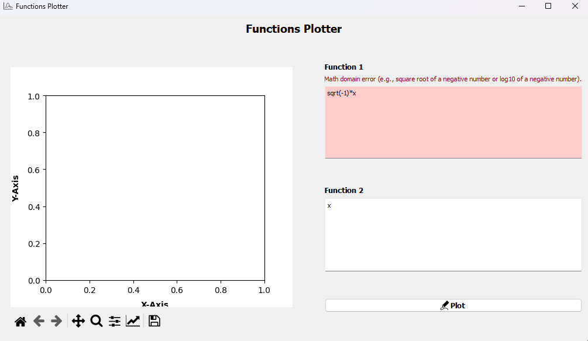
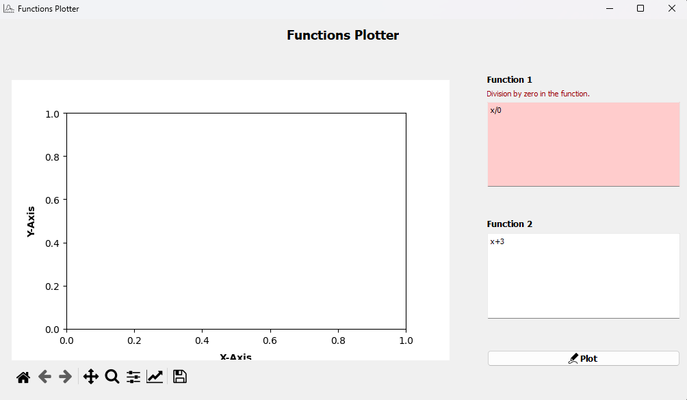
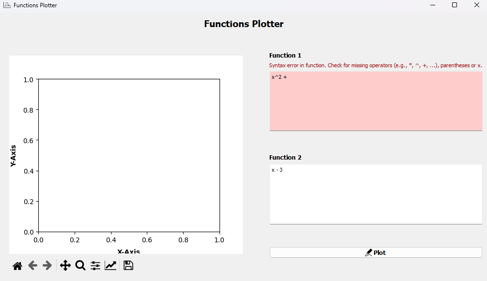
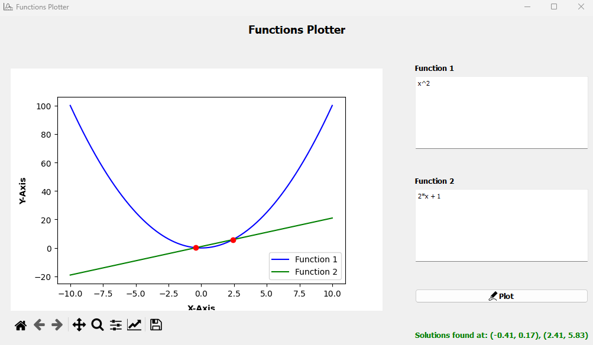
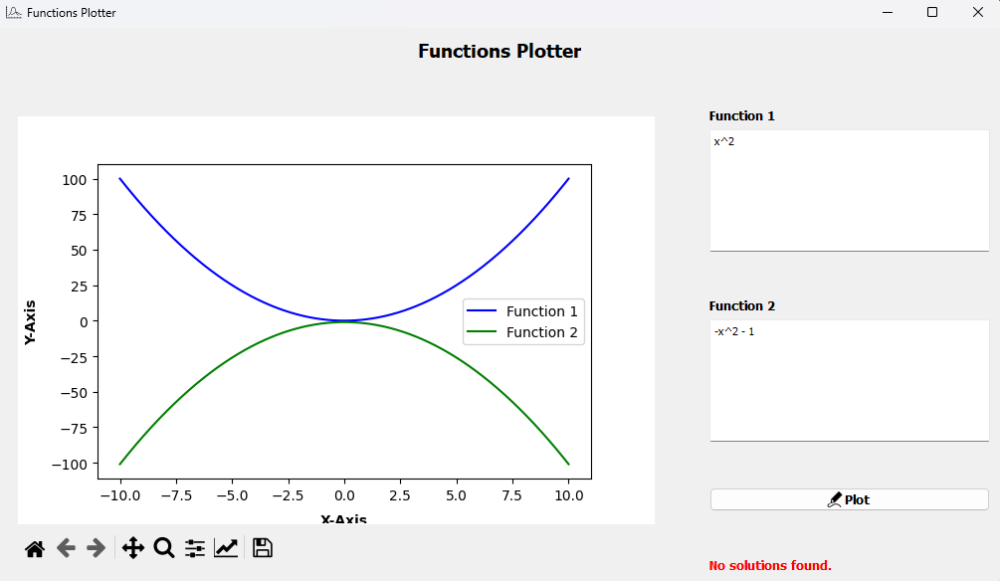
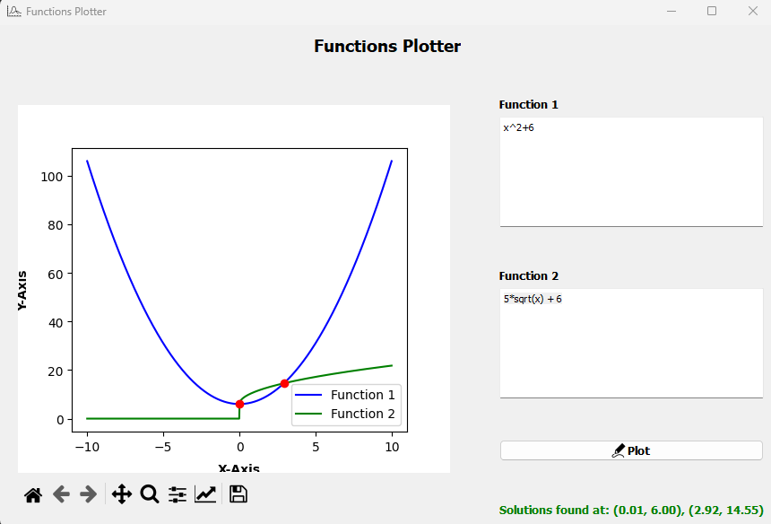
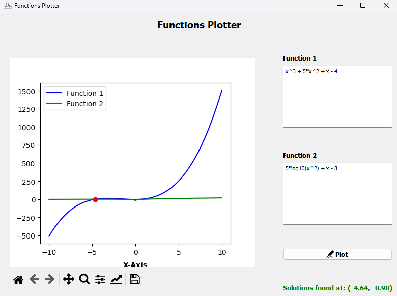

# README

## Functions Plotter Application

This is a Python-based application built using PySide2 (Qt for Python) and Matplotlib. It allows users to input two mathematical functions, plot them on a graph, and find their intersection points (roots). The application also handles various error cases, such as invalid syntax, division by zero, and math domain errors.

---

## Features

1. **Function Input**: Users can input two mathematical functions using `x` as the variable.
2. **Plotting**: The application plots the two functions on a graph.
3. **Root Finding**: It calculates and displays the intersection points (roots) of the two functions.
4. **Error Handling**: The application provides detailed error messages for:
   - Invalid syntax
   - Division by zero
   - Math domain errors (e.g., square root of a negative number or log10 of a negative number)
   - Undefined variables or functions
   - Empty function inputs

---

## Requirements

To run this application, you need the following Python packages installed:

- `PySide2` (Qt for Python)
- `numpy`
- `matplotlib`
- `scipy`
- `Python Version 3.9.7`

You can install the required packages using `pip`:

```bash
pip install PySide2 numpy matplotlib scipy
```

---

## How to Run

1. Clone the repository or download the source code.
2. Navigate to the project directory.
3. Run the application using Python:

   ```bash
   python FunctionsPlotter.py
   ```

4. The application window will open, allowing you to input functions and plot them.

---

## Usage

1. **Input Functions**:

   - Enter the first function in the "Function 1" text box.
   - Enter the second function in the "Function 2" text box.
   - Supported operations: `+`, `-`, `*`, `/`, `^` (exponentiation), `sqrt`, `log10`.

2. **Plot Functions**:

   - Click the "Plot" button to plot the functions and find their intersection points.

3. **View Results**:
   - The graph will display the two functions.
   - If the functions intersect, the intersection points will be highlighted and displayed below the graph.
   - If there are errors (e.g., invalid syntax), an error message will be displayed.

---

## Screenshots

### Error Examples

1. **Math Domain Error**:

   - Example: `sqrt(-1)*x`
   - Error Message: "Math domain error (e.g., square root of a negative number)."

     

2. **Division by Zero**:

   - Example: `x/0`
   - Error Message: "Division by zero in the function."

     

3. **Invalid Syntax**:

   - Example: `x^2 +`
   - Error Message: "Syntax error in function. Check for missing operators (e.g., \*, ^, +, ...), parentheses or x."

     

### Success Examples

1. **Valid Functions with Intersection**:

   - Example: `x^2` and `2*x + 1`
   - Result: The graph shows the intersection points.

     

2. **No Intersection**:

   - Example: `x^2` and `-x^2 - 1`
   - Result: The graph shows no intersection points, and the message "No solutions found." is displayed.

     

3. **Square Root Function**:

   - Example: `x^2 + 6` and `5*sqrt(x) + 6`
   - Result: The graph shows multiple intersection points, and the roots are displayed.

     

4. **log10 Function**:

   - Example: `x^3 + 5*x^2 + x - 4` and `5*log10(x^2) + x - 3`
   - Result: The graph shows multiple intersection points, and the roots are displayed.

     

---

## Testing

The application includes automated tests using `pytest` and `pytest-qt`. To run the tests:

1. Install `pytest` and `pytest-qt`:

   ```bash
   pip install pytest pytest-qt
   ```

2. Run the tests:

   ```bash
   pytest tests.py -v
   ```

---

## Code Structure

- **`FunctionsPlotter.py`**: The main application file containing the UI setup and logic.
- **`mplwidget.py`**: A custom widget for embedding Matplotlib plots in the Qt application.
- **`tests.py`**: Automated tests for the application.

---

## License

This project is open-source and available under the MIT License. Feel free to use, modify, and distribute it as per the license terms.

---

## Contributing

If you'd like to contribute to this project, please fork the repository and submit a pull request. Contributions are welcome!

---

## Contact

For any questions or feedback, please contact [Youssef Hassanien] at [youssef.ali01@eng-st.cu.edu.eg].

---

Enjoy plotting functions! 🚀
